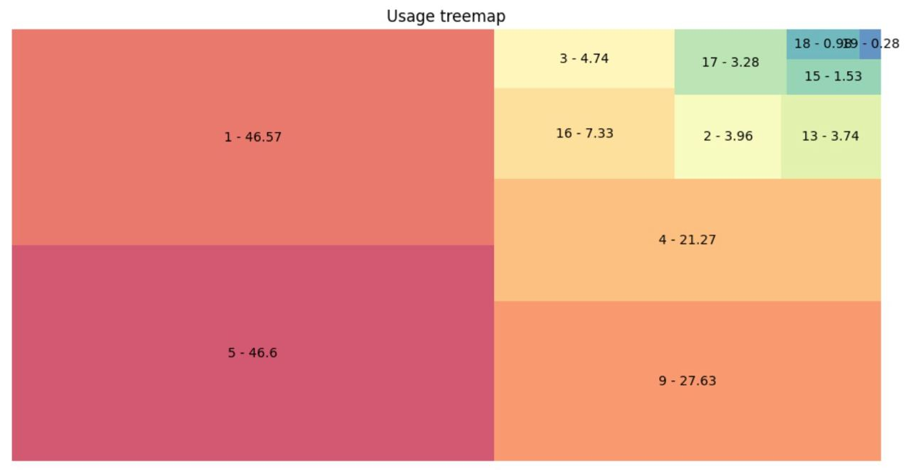
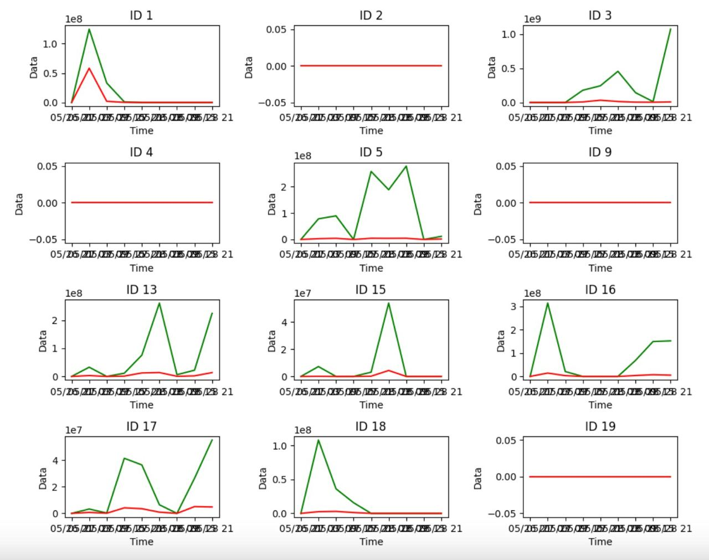
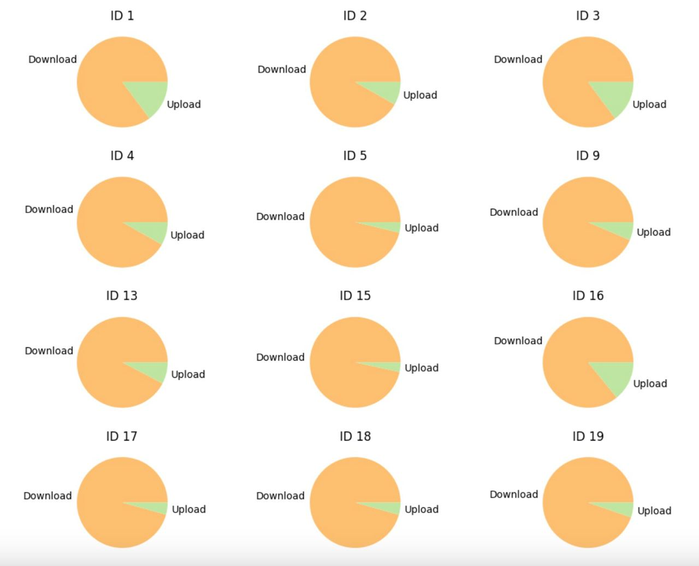
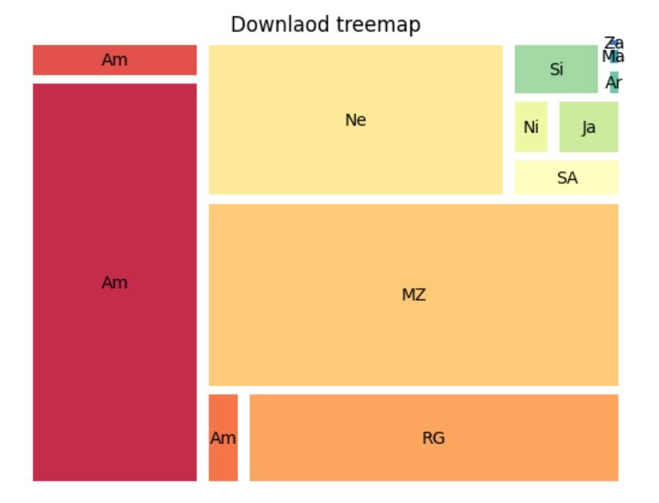
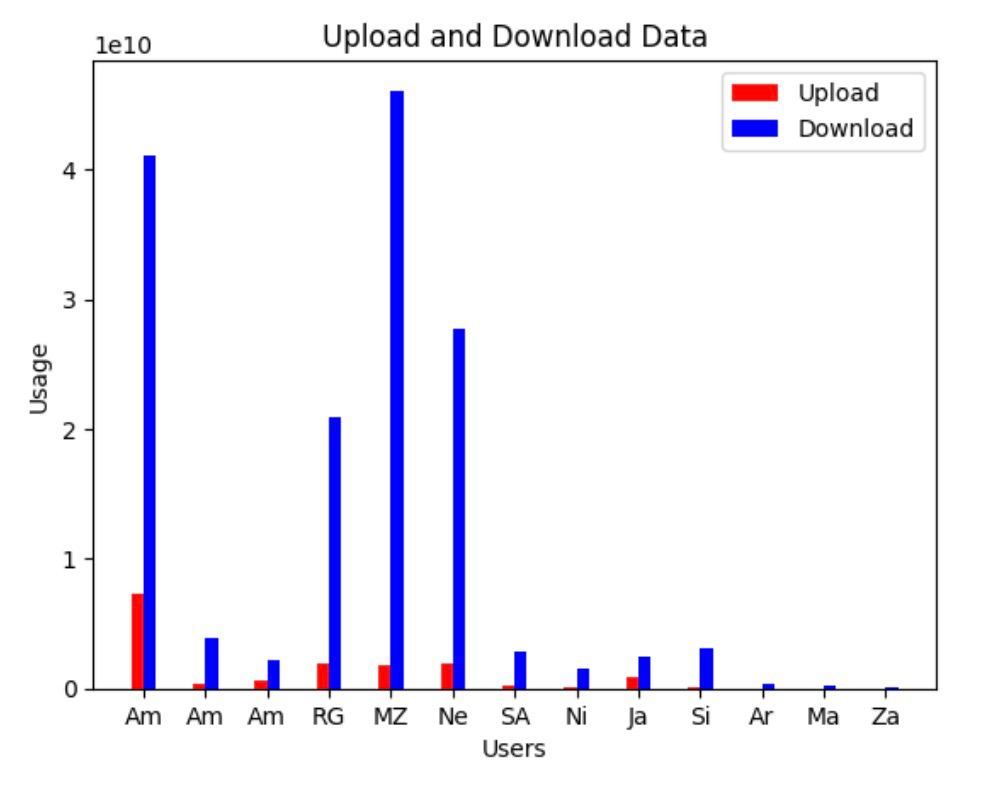
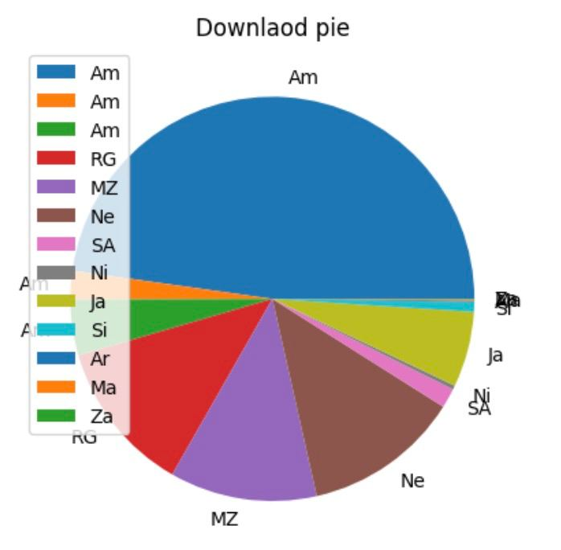
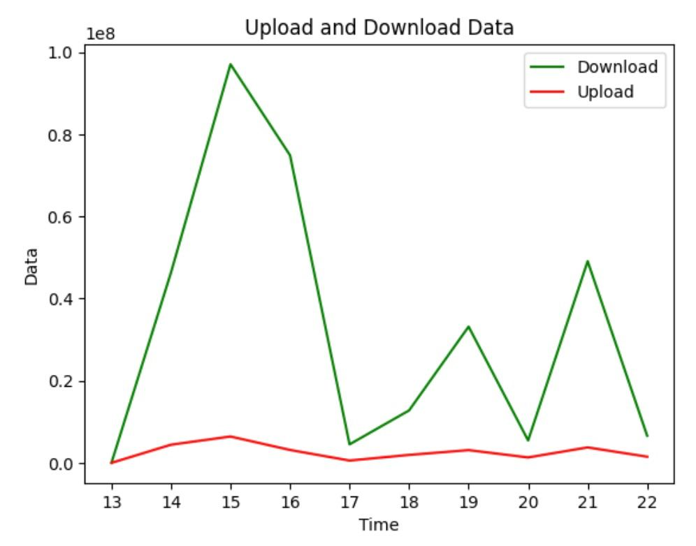
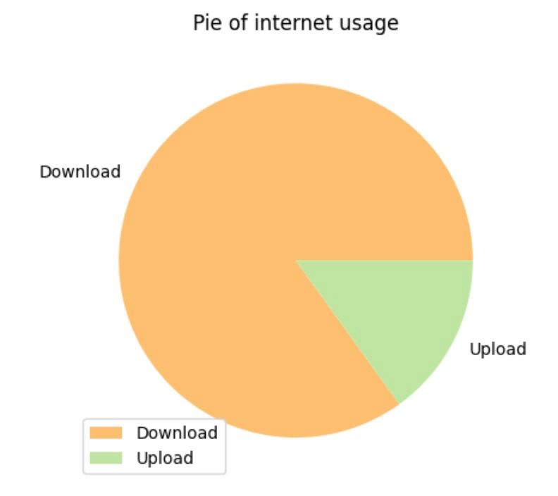

# Learning basics of data analytics and entering to this world.

I am learning finance under master **Ayoub Goudarzi** and he told me to start with some small data.

So, what I had inside my mind was to work on **tmctse** but most of people use it and it has many pre created stuff. I changed my mind and worked on internet usage with **VPN**.

## VPN

I created a simple v2ray vpn with x-ui just for my project and give people configs to connect and use that I be able to make some analytics with usage.

## Project

Inside project you can see a notebooks and a script. With script we collect data and with notebook we analyze colelcted data. Something like this.

### Charts

We had notebooks in this project like `total` and `collect` that I delete them. We now have a notebook that do everything. Let's review what kind of charts did we have.

So, let's review our charts. I used `subplot` for this update.

|                  Treemap                  |                Bar                 |                Pie                |
| :---------------------------------------: | :--------------------------------: | :-------------------------------: |
|  |  |  |

#### Old notebooks

The `total` notebook was where it collect all data and give you **treemap**, **bar chart** and **pie chart**.

|                 Treemap                 |               Bar               |               Pie               |
| :-------------------------------------: | :-----------------------------: | :-----------------------------: |
|  |  |  |

At `user` notebook we had **line chart**,and **pie chart**..

|               Bar               |              Pie               |
| :-----------------------------: | :----------------------------: |
|  |  |

### Collect script

With with notebook we collect usage and save in database. But we created that notebook in a script that it is placed in a server that runs every 1 hour with crontab.
